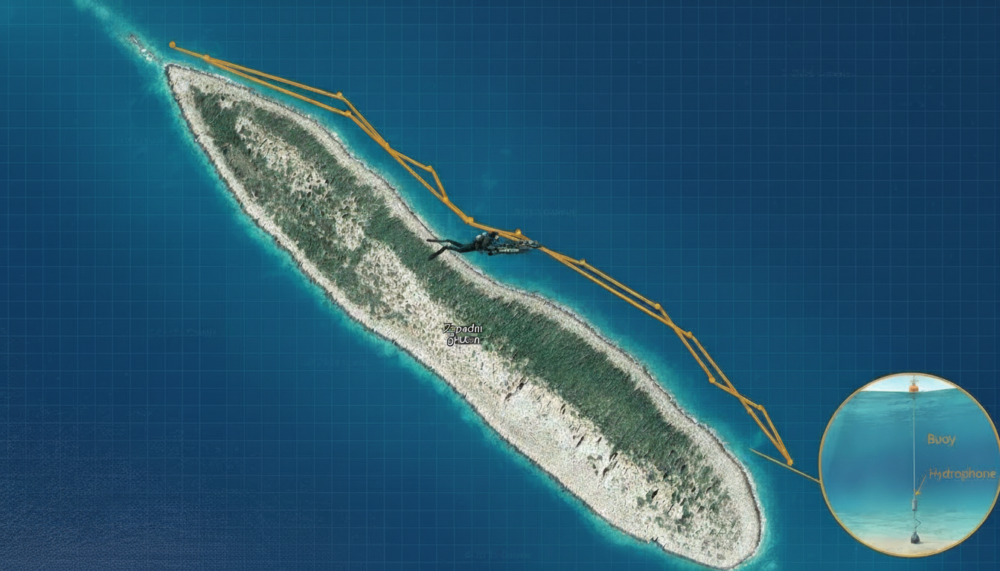
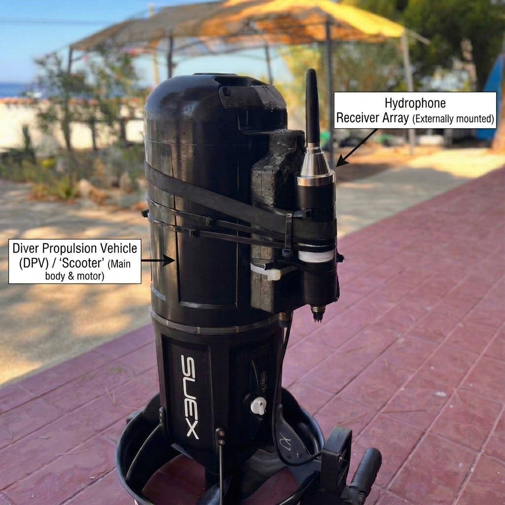
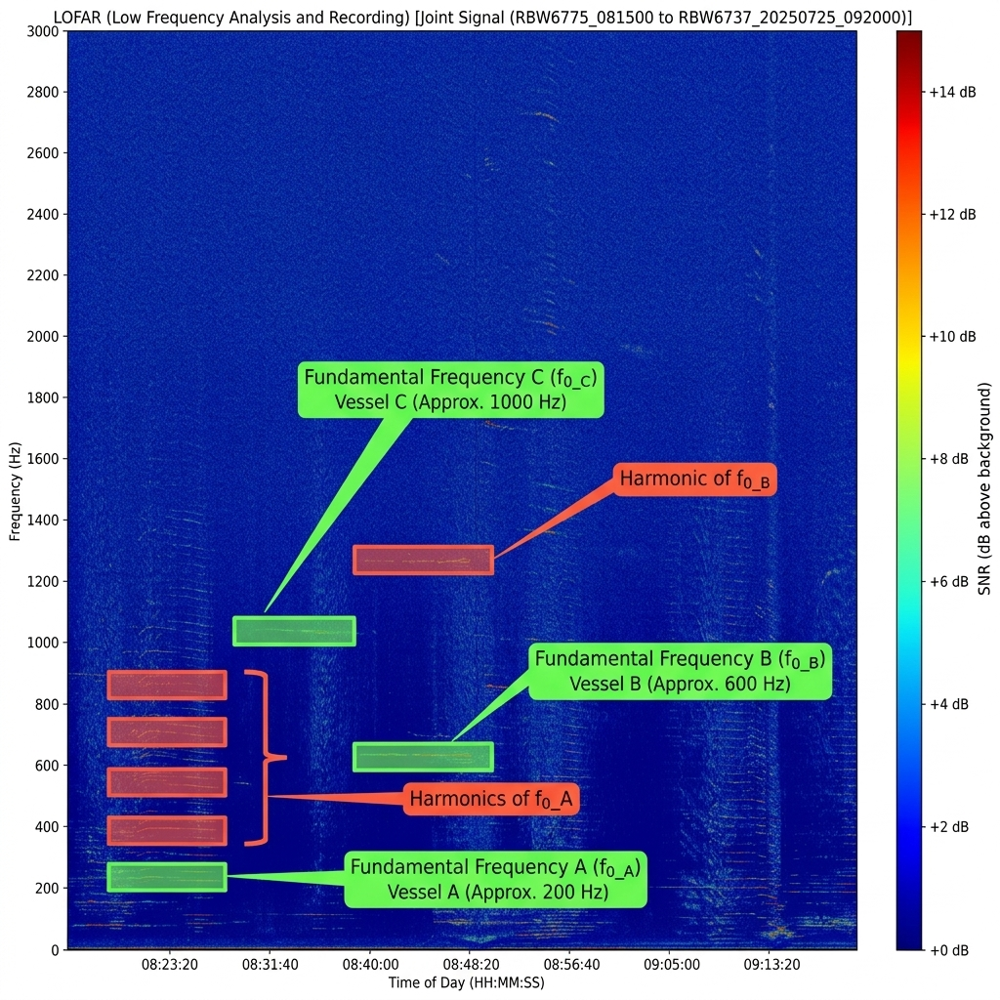
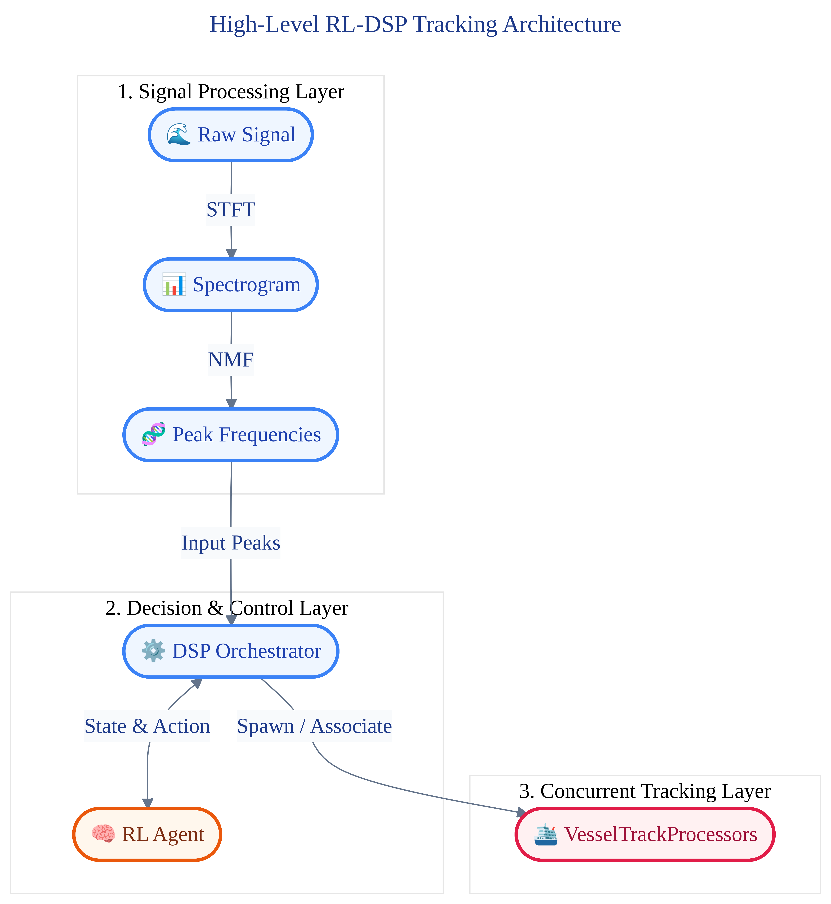
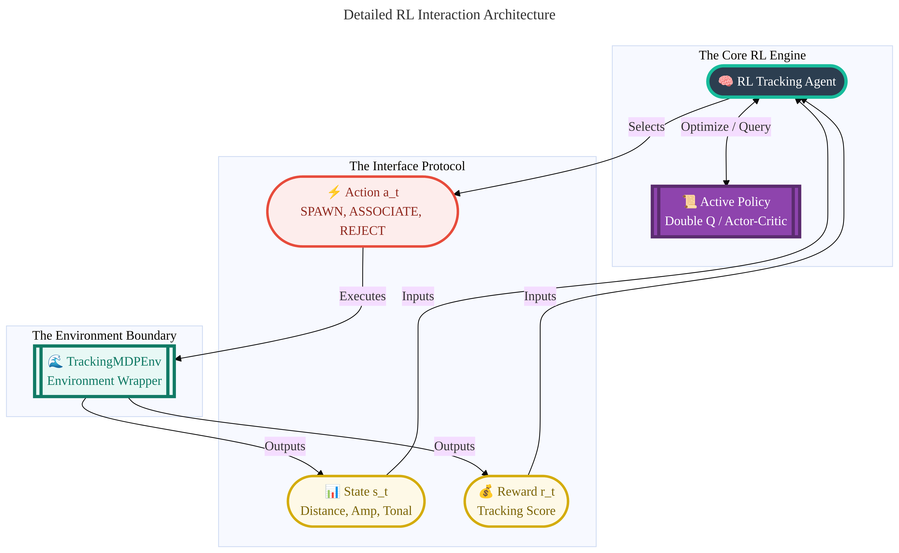
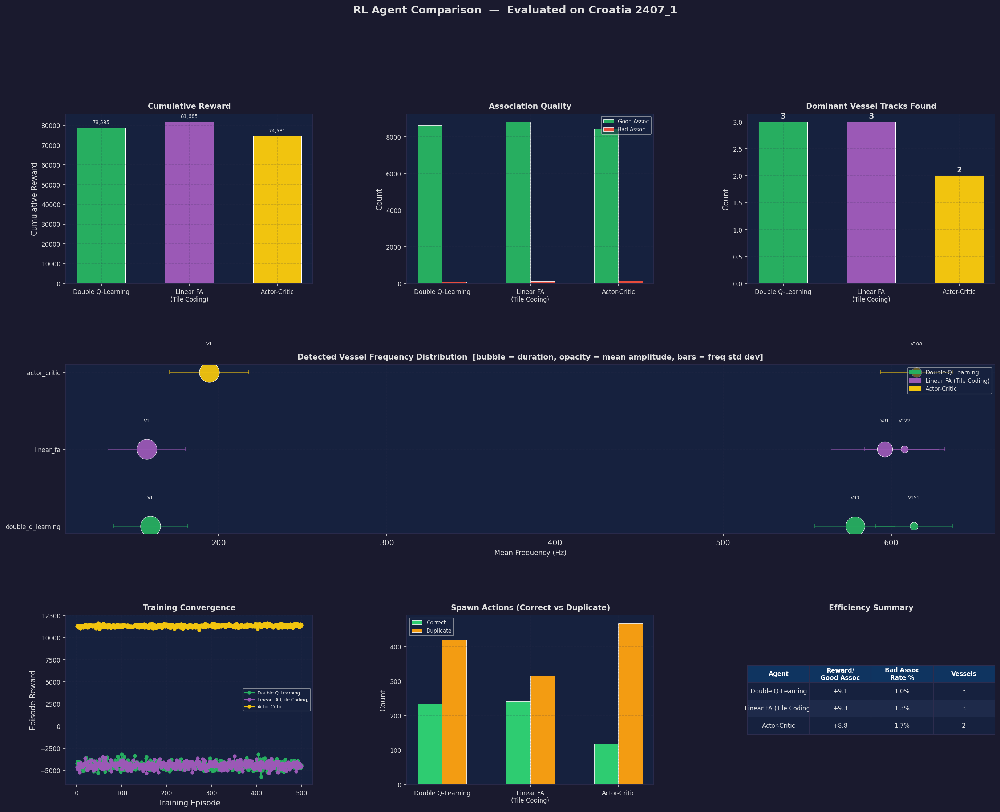
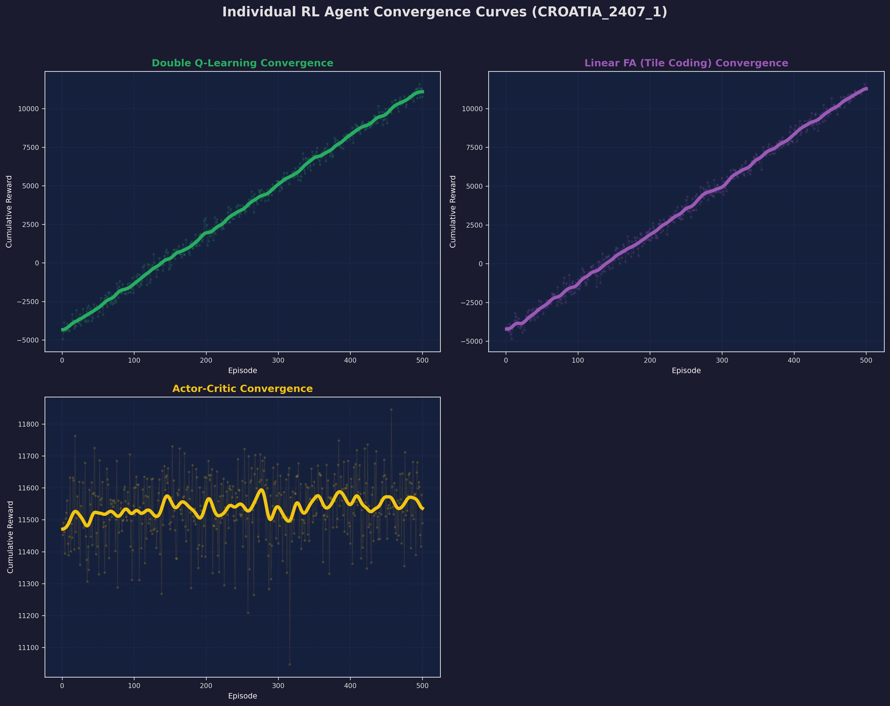
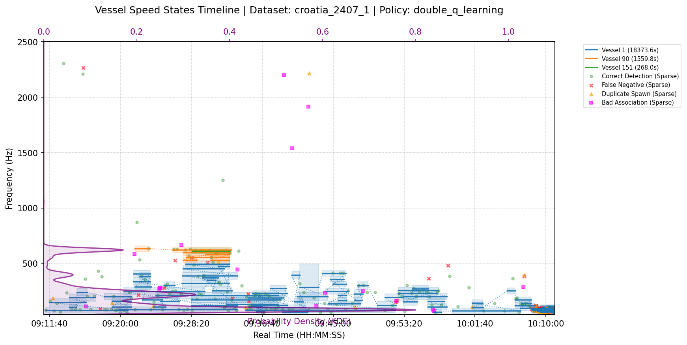
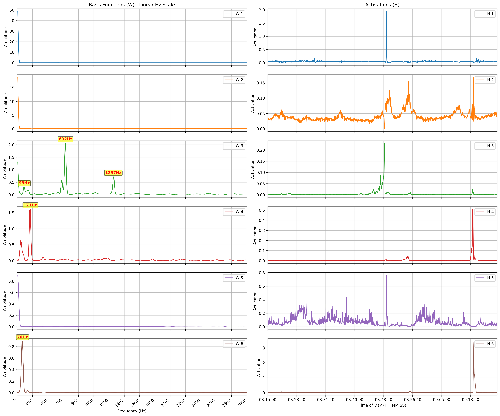

<style>
body {
    font-family: Arial, sans-serif;
    font-size: 12pt;
    line-height: 1.5;
    padding: 1in;
}
</style>

# Final Project Report: Reinforcement Learning for Underwater Acoustic Vessel Detection and Tracking

**Course**: Introduction to Reinforcement Learning  
**Authors**: Roy Michael  
**Date**: June 2026  

---

## Abstract

This project presents a reinforcement learning (RL) framework for real-time detection, tracking, and speed-stage matching of marine vessels using passive sonar acoustic signals. In underwater acoustics, acoustic signals undergo substantial frequency drift and amplitude degradation due to varying vessel velocities, multi-path propagation, and ocean ambient noise. Here we model the peak association and track-spawning process as a Markov Decision Process (MDP), where the agent learns to associate peaks and create tracks. We implement and evaluate three distinct reinforcement learning paradigms: Double Q-Learning, Linear Function Approximation with Tile Coding, and Actor-Critic. The models are trained and verified on real-world acoustic datasets using the Ocean Sonics hydrophone recordings from Haifa and Croatia. Our results shows that reinforcement learning agents achieve highly precise vessel trajectory reconstruction, adapt dynamically to velocity-induced frequency transitions.


---

## 1. Project Overview & Motivation

### 1.1 Motivation
Passive sonar systems process continuous acoustic spectrum streams to monitor maritime traffic and detect underwater targets. Traditional methods rely heavily on manually tuned heuristic trackers (e.g., nearest-neighbor Kalman filters or constant-velocity models). However, marine environments are characterized by high levels of non-stationary noise (such as biological clicks, wave action, and wind clutter) and complex target dynamics. When a vessel shifts its speed, the fundamental frequency (tonal component) emitted by its propulsion system undergoes significant frequency drift. Heuristic thresholds are either too narrow (causing target loss during acceleration) or too wide (causing false associations with adjacent noise peaks). 

### 1.2 Objectives
This project refactors the traditional tracking system into an agentic Reinforcement Learning process where it's primary objectives are:
1. To formulate vessel detection and tracking as an MDP, by decoupling the state representation, decision actions, and reward rules.
2.  To integrate trained RL policies into a structured tracking hierarchy consisting of a central DSP Orchestrator and dynamically spawned Vessel Track Processor instances.
3. To evaluate and compare the RL algorithm families under rigorous training (500 episodes on the Croatia dataset) to demonstrate stable policy convergence.
4. To establish a framework using audio files to produce outputs, displaying charts, timeline graphs, and text reports reflect real-world signal and detection characteristics.

### 1.3 Data Collection & Experimental Setup

The acoustic dataset evaluated in this study was compiled from field trials conducted in two distinct marine environments during June and July 2025:
1.  **Croatia Ocean Sonics Dataset (Silba Island)**: Comprising recordings from high-frequency hydrophones deployed near Zapadni Greben, Silba Island, Croatia. These recordings capture the acoustic signature of Suex VRX Diver Propulsion Vehicles (DPVs) along with standard surface vessels (e.g., small motorboats) to create realistic, overlapping interference scenarios.
2.  **Haifa Dataset**: Focusing on the acoustic signature of a Seacraft GO! DVP maneuvering on prescribed circular/linear tracks in shallow coastal waters (18-25 m depth) in Haifa, Israel.

#### Recording Equipment & Setup
Acoustic measurements were recorded using high-performance equipment to ensure fidelity:
*   **Acoustic Recorder**: An `icListen HF ALTA` acoustic recorder unit, sampling continuous data at 128 kHz, saving data in lossless `.wav` format.
*   **Hydrophones**: A preamplified `Ocean Sonics icListen` hydrophone. 
*   **Mooring Configuration**: Hydrophones were attached to seabed-anchored mooring lines at depths of approximately 10–30 meters (matching the divers' dive depths) to eliminate surface wave action and buoy movement noise.



Figure 1.1 shows the field experiment setup and trail in Silba, Croatia (Silba 1k). A calibrated hydrophone is mounted on an underwater frame resting on the seabed at a depth of approximately 20 meters. 
The sensor is cabled and samples at high rates to capture acoustic tonals of vessels passing.

#### Underwater Acoustic Communication & Receiver Array
To correlate acoustic signatures with physical locations, we utilize a specialized underwater acoustic receiver system:

<table style="width: 100%; border: none;">
  <tr style="border: none;">
    <td style="width: 50%; text-align: center; border: none; padding: 5px;">
      
      <br>
      <em>Figure 1.2: Underwater Acoustic Receiver Setup (Annotated with DPV/Scooter and Hydrophone positions)</em>
    </td>
    <td style="width: 50%; text-align: center; border: none; padding: 5px;">
      
      <br>
      <em>Figure 1.3: Small Support Vessel/Boat Acoustic Tracking Experiment</em>
    </td>
  </tr>
</table>


---

## 2. Introduction to Underwater Acoustics and Passive Detection

Underwater acoustic propagation is the primary modality for underwater sensing, communication, and target tracking. Electromagnetic waves (such as light and radio waves) suffer from extreme attenuation in saline water, leaving acoustic waves (which travel at approximately $c \approx 1500$ m/s) as the only viable mechanism for long-range marine observation.

### 2.1 Passive Sonar and Spectrograms
Passive sonar systems listen to the sound radiated by targets without transmitting active pulses. The received time-domain pressure signal is converted to the time-frequency domain using the Short-Time Fourier Transform (STFT) to produce Low-Frequency Analysis and Recording (LOFAR) spectrograms. Within these spectrograms (as shown in Figure 2.1), target signatures manifest in two forms:
*   **Broadband Background Noise**: Continuous, non-stationary noise distributed flatly across the spectrum, generated by wave action, wind, thermal activity, and shipping traffic.
*   **Narrowband Tonals**: Highly concentrated horizontal lines generated by rotating machinery, engines, generators, and propeller blade rates. These tonals carry the unique acoustic signature of the vessel.

### 2.2 Physical Challenges of Acoustic Tracking
Acoustic vessel tracking is highly challenging due to several physical phenomena:
1.  **Doppler Frequency Drift**: When a vessel moves relative to the hydrophone, the observed frequency shifts:
    $$f_{\text{observed}} = f_0 \left( \frac{c \pm v_r}{c \mp v_s} \right)$$
    where $v_s$ and $v_r$ are the source and receiver velocities. During vessel acceleration or turning maneuvers, these shifts cause the tonals to "slide" across frequency bins.
2.  **Multipath Propagation & Echoes**: Acoustic waves reflect off both the sea surface and the seabed, creating multiple delayed paths. This results in parallel phantom tracks (multipath echoes) and harmonic overtones, as illustrated in Figure 2.1b.
3.  **Acoustic Fading (Doppler Nulls)**: Destructive interference from multipath propagation causes temporary signal drops, requiring the tracking system to maintain track coherence through periods of zero-amplitude detections.

<table style="width: 100%; border: none;">
  <tr style="border: none;">
    <td style="width: 60%; text-align: center; border: none; padding: 5px;">
      
      <br>
      <em>Figure 2.1a: Raw LOFAR spectrogram showing overlapping vessel target signatures and ambient noise.</em>
    </td>
    <td style="width: 40%; text-align: center; border: none; padding: 5px;">
      
      <br>
      <em>Figure 2.1b: Annotated LOFAR spectrogram showing base frequencies (green) and harmonics (orange/red).</em>
    </td>
  </tr>
</table>

---

## 3. Problem Formulation

The tracking task is formulated as a discrete-time Markov Decision Process (MDP) defined by the tuple ⟨<i>S</i>, <i>A</i>, <i>P</i>, <i>R</i>, <i>γ</i>⟩.

### 3.1 State Space (<i>S</i>)
The state representation is designed to capture the spatial and spectral relationship between a newly detected acoustic frequency peak and the existing target tracks. The raw continuous feature vector is:
<div style="text-align: center; margin: 1em 0;"><b>s</b><sub>continuous</sub> = (<i>d</i><sub>Hz</sub>, <i>A</i>, <i>T</i>)</div>
where:
*   <i>d</i><sub>Hz</sub>: The spectral distance (in Hz) from the detection's centroid frequency to the mean frequency of the closest active vessel tracking processor.
*   <i>A</i>: The relative amplitude (activation weight) of the detection.
*   <i>T</i>: The tonality score. Tonality measures how "mechanical" and continuous a sound is compared to random broadband noise. High tonality (<i>T</i> ≈ 1.0) suggests a clear motorboat engine or propeller, while low tonality (<i>T</i> ≈ 0.0) suggests transient ocean noise (e.g., crashing waves). See [Appendix B](#appendix-b-mathematics-of-tonality-spectral-flatness) for the mathematical definition based on Spectral Flatness.

For tabular policies, the environment discretizes these continuous features into a state tuple <b>s</b><sub>discrete</sub> = (bin<sub>dist</sub>, bin<sub>amp</sub>, bin<sub>tonal</sub>):
*   **Distance Bins**:
    *   `0`: Very close (<i>d</i><sub>Hz</sub> ≤ 15.0 Hz)
    *   `1`: Moderately close (<i>d</i><sub>Hz</sub> ≤ 45.0 Hz)
    *   `2`: Far but potentially related (<i>d</i><sub>Hz</sub> ≤ 90.0 Hz)
    *   `3`: Out of range / completely unrelated (<i>d</i><sub>Hz</sub> > 90.0 Hz)
*   **Amplitude Bins**:
    *   `0`: Low amplitude (<i>A</i> < 0.005)
    *   `1`: Medium amplitude (0.005 ≤ <i>A</i> < 0.02)
    *   `2`: High amplitude (<i>A</i> ≥ 0.02)
*   **Tonality Bins**:
    *   `0`: Likely noise (<i>T</i> < 0.45)
    *   `1`: Moderate tonality (0.45 ≤ <i>T</i> < 0.65)
    *   `2`: High tonality (<i>T</i> ≥ 0.65)

### 3.2 Action Space (<i>A</i>)
At each step (upon receiving a valid acoustic peak), the agent selects from three discrete actions:
1.  **REJECT (<i>a</i> = 0)**: Ignore the peak as ambient noise or clutter.
2.  **ASSOCIATE (<i>a</i> = 1)**: Assign the peak observation to the nearest active tracking signal processor (updating its frequency tracking history and resetting its timeout).
3.  **SPAWN (<i>a</i> = 2)**: Spawn a new `VesselTrackProcessor` child instance representing a newly discovered target.

### 3.3 Reward Function (<i>R</i>)
The reward function is isolated within the `TrackingRewardCalculator` to decouple agent evaluation from environment dynamics:
*   **Reject Action**:
    *   *Correct Reject*: +2.0 (when ignoring distant/noise peaks).
    *   *False Negative (Miss)*: -10.0 (when ignoring a close, highly tonal target signature).
*   **Associate Action**:
    *   *Good Association*: +10.0 (matching within the association threshold <i>d</i><sub>Hz</sub> ≤ 30.0 Hz).
    *   *Speed Change*: +5.0 (matching within the proximity threshold <i>d</i><sub>Hz</sub> ≤ 65.0 Hz, triggering a speed stage segment split under the same Vessel ID).
    *   *Bad Association (Mismatch)*: -15.0 (forced association with a distant target).
    *   *Invalid Association*: -20.0 (attempting to associate when no target tracks exist).
*   **Spawn Action**:
    *   *Duplicate Spawn*: -10.0 (spawning a new track when a close active track already exists).
    *   *Correct Spawn (High Tonal)*: +10.0 (starting a track on a strong, unassociated tonal peak).
    *   *Correct Spawn (Medium Tonal)*: +5.0 (starting a track on a moderate tonal peak).

### 3.4 System Dynamics, Policy and Actions
The formulation for this reinforcement learning problem considers the agent's **Policy (<i>π</i>)**, the **Actions (<i>a</i> ∈ <i>A</i>)**, and the **System Dynamics** (both the physical target motion and the environment's state transition probability <i>P</i>(<i>s'</i> | <i>s</i>, <i>a</i>)):
*   **Policy (<i>π</i>)**: The policy dictates how the agent maps a given state (representing distance, amplitude, tonality, and track age) to one of the tracking actions. It represents the decision-making intelligence of the tracker.
*   **Actions (<i>a</i>)**: These are the direct control options (REJECT, ASSOCIATE, SPAWN) available to the policy at each discrete decision step.
*   **State Transition Dynamics (<i>P</i>(<i>s'</i> | <i>s</i>, <i>a</i>))**: This defines how the tracking state updates as a consequence of the action taken under the current physical situation. For example, selecting `ASSOCIATE` on a nearby peak updates the target's frequency history, resetting its timeout and setting the next step's distance <i>d</i><sub>Hz</sub> to a low value (stabilizing the track). Conversely, selecting `REJECT` leaves the active tracks unchanged, allowing them to age or eventually time out.

### 3.5 Types of Dynamics Evaluated in the Experiment
The tracking system operates over three main classes of physical target and acoustic dynamics:
1.  **Constant-Velocity (Stable) Target Dynamics**: Represented by vessels travelling at a uniform speed. Acoustically, this corresponds to steady, narrow-band spectral lines with very low frequency drift. The optimal transition dynamics for these targets involve repeated, high-confidence `ASSOCIATE` actions, slowly increasing the track age.
2.  **Accelerating/Drifting Target Dynamics (Speed Changes)**: When vessels accelerate or turn, Doppler shifts and engine load changes induce substantial frequency drift. In these dynamics, the transition distance <i>d</i><sub>Hz</sub> increases. The agent's dynamics must support transitioning from regular association to speed stage splitting (under the same Vessel ID) to prevent track termination while avoiding false associations with surrounding clutter.
3.  **Transient Acoustic Clutter & Noise Dynamics**: Characterized by high-amplitude, high-tonality peaks that persist for only a few frames (e.g., dolphin clicks or sonar pings). Because their active lifetime is short, incorporating **Track Age** into the state representation ensures the agent can distinguish these transients from true targets: a young track (low age) with weak tonality will have high transition probabilities to high-penalty states if the agent attempts to repeatedly associate with it.

### 3.6 Reward Calculation & Training Protocol

To clarify how decisions affect model updates, we detail the modular training loop and the exact logic used to evaluate step-wise rewards.

#### 3.6.1 The Training Loop
Training is executed via the `scripts/train_rl.py` script and follows a standard episodic reinforcement learning loop:
1.  **Initialization**: The learning policy initializes its values, weights, or tables. If a saved policy file exists in the `models/` directory for the chosen agent and dataset, it is loaded to bootstrap training. Otherwise, the agent starts fresh with the following defaults:
    *   **Double Q-Learning**: Uses *lazy (on-the-fly) initialization*. When a discrete state tuple <b>s</b> is first visited, its values are set to zero in both Q-tables: <i>Q<sub>A</sub></i>(<b>s</b>, <i>a</i>) = 0.0 and <i>Q<sub>B</sub></i>(<b>s</b>, <i>a</i>) = 0.0 for all actions <i>a</i> ∈ {0, 1, 2}.
    *   **Actor-Critic**: Uses *lazy initialization*. On the first encounter of a state <b>s</b>, the Critic's state-value function is initialized to <i>V</i>(<b>s</b>) = 0.0, and the Actor's action preferences are initialized to <b>θ</b>(<b>s</b>) = [0.0, 0.0, 0.0]. Under the Softmax policy, this ensures a uniform action selection probability of ≈ 33.3% for all three options to maximize initial exploration.
    *   **Linear FA**: Uses *eager initialization*. The continuous feature weights matrix <b>w</b> (size 3 × 2048) is instantiated as a flat matrix of zeros: <i>w<sub>a, i</sub></i> = 0.0 for all actions <i>a</i> and tiling indices <i>i</i>.
2.  **Episode Loop**: Over 500 training episodes, the script loads a sliding set of raw `.wav` recordings from the selected dataset (e.g., `croatia_2407_1`).
3.  **Frame Streaming**: The low-level `Environment` streams spectral frames step-by-step. For each frame, the `DSPOrchestrator` performs NMF (see [Appendix A](#appendix-a-non-negative-matrix-factorization-nmf-in-sonar-processing) for mathematical definition and details) and extracts candidate peaks.
4.  **<i>ε</i>-Greedy Action Selection**: The `RLAgent` observes the state <b>s</b><sub><i>t</i></sub> from the `TrackingMDPEnv`. With probability <i>ε</i> (which decays linearly from 1.0 down to 0.05 over the course of the episodes), the agent selects a random action to explore; otherwise, it greedily selects the action maximizing the estimated Q-value <i>a<sub>t</sub></i> = argmax<sub><i>a</i></sub> <i>Q</i>(<i>s<sub>t</sub></i>, <i>a</i>).
5.  **Environment Transition**: The selected action is executed. The environment delegates track modifications to the `DSPOrchestrator` (spawning child agents or routing peaks) and returns the state transition <b>s</b><sub><i>t+1</i></sub> and reward <i>r<sub>t</sub></i>.
6.  **Temporal Difference Update**: The policy performs a TD(0) value update using the transition tuple (<i>s<sub>t</sub></i>, <i>a<sub>t</sub></i>, <i>r<sub>t</sub></i>, <i>s<sub>t+1</sub></i>).

#### 3.6.2 Action-Reward Resolution by Component

The reward is computed step-by-step by the `TrackingRewardCalculator` within `TrackingMDPEnv`. The rewards and state modifications are resolved specifically based on the action chosen:


*Figure 2.1: Action-Reward Resolution Flowchart mapping agent decisions to environment feedback and rewards.*

##### 1. REJECT (<i>a</i> = 0)
*   **Environment Action**: Discard the peak observation. The `DSPOrchestrator` takes no action, allowing any active `VesselTrackProcessor` child instances to age (which increases their risk of timing out and closing).
*   **Reward Decision**:
    *   **Correct Reject (<i>r</i> = +2.0)**: If there is no active target close by (<i>d</i><sub>Hz</sub> > 35.0 Hz) or if the peak's tonality score is weak (<i>T</i> < 0.45). This encourages filtering out background noise.
    *   **False Negative Miss (<i>r</i> = -10.0)**: If the peak is close to a target (<i>d</i><sub>Hz</sub> ≤ 35.0 Hz) and has strong tonality (<i>T</i> ≥ 0.45). This penalizes the agent for ignoring valid target signatures.

##### 3. ASSOCIATE (<i>a</i> = 1)
*   **Environment Action**: Route the peak to the closest tracking target. If targets exist, the `DSPOrchestrator` updates the matching `VesselTrackProcessor`'s frequency history and resets its timeout.
*   **Reward Decision**:
    *   **Invalid Association (<i>r</i> = -20.0)**: If no active `VesselTrackProcessor` tracks currently exist in the environment.
    *   **Good Association (<i>r</i> = +10.0)**: If the peak is within the tight association threshold (<i>d</i><sub>Hz</sub> ≤ 30.0 Hz).
    *   **Speed Stage Change (<i>r</i> = +5.0)**: If the peak is within the proximity threshold (30.0 < <i>d</i><sub>Hz</sub> ≤ 65.0 Hz), indicating the target changed velocity (inducing a frequency drift). The `DSPOrchestrator` splits the track into a new speed stage under the same Vessel ID.
    *   **Mismatch Penalty (<i>r</i> = -15.0)**: If the peak is far (<i>d</i><sub>Hz</sub> > 65.0 Hz), penalizing the agent for forcing an association with a different target.

##### 4. SPAWN (<i>a</i> = 2)
*   **Environment Action**: Create a new tracker. The `DSPOrchestrator` instantiates a new child `VesselTrackProcessor` to begin tracking this frequency.
*   **Reward Decision**:
    *   **Duplicate Spawn (<i>r</i> = -10.0)**: If a `VesselTrackProcessor` is already active nearby (<i>d</i><sub>Hz</sub> ≤ 35.0 Hz). This penalizes the agent for creating duplicate tracks for the same vessel.
    *   **Correct Spawn - High Tonal (<i>r</i> = +10.0)**: If no close tracker exists and the peak is highly tonal (<i>T</i> ≥ 0.65), suggesting a clear engine tone.
    *   **Correct Spawn - Med Tonal (<i>r</i> = +5.0)**: If no close tracker exists and the peak is moderately tonal (<i>T</i> < 0.65).

#### 3.6.3 Rationale and Choice of Reward Magnitudes

The reward numerical values were selected to create a balanced, zero-sum-like reward structure:

1.  **Symmetric Baseline (±10.0)**: Maintaining a continuous track (Good Association) is the primary objective and yields the highest reward (`+10.0`). Conversely, missing a valid target (False Negative) or cluttering the DSP layer with duplicates yields an equal and opposite penalty (`-10.0`).
2.  **Severe Illegal Penalties (-20.0)**: Attempting to associate to a non-existent track is mathematically invalid. This penalty is doubled to quickly collapse this illegal behavior during the agent's early exploration phase.
3.  **Spawn Moderation (+5.0)**: Spawning a moderately tonal target yields `+5.0`. This reward must be strictly lower than the `+10.0` association reward. If spawning yielded a higher reward, the agent would learn a detrimental policy of constantly dropping tracks and spawning new ones to farm points.
4.  **Lazy Policy Prevention (+2.0)**: Filtering background noise (Correct Reject) is necessary but trivial. It yields a very small positive baseline (`+2.0`). If this reward were higher, the agent would learn a "lazy" policy where it rejects every single peak to safely accumulate points without the risk of association penalties.

#### 3.6.4 Physical Logic Behind Tracking Rules

The action-reward framework directly models the physical realities of marine acoustics:
*   **Association Logic (The Doppler Shift)**: A vessel moving at a constant speed emits a steady frequency. If the distance to a new spectral peak is very small (≤ 30 Hz), it strongly implies the same propeller spinning at the same RPM. If the distance is wider (30-65 Hz), it represents a **Speed Change / Doppler Drift**, where the vessel has accelerated or shifted relative to the hydrophone, causing a frequency slide. The agent learns to stitch these slides together rather than dropping the track.
*   **Duplication Logic (Echoes & Harmonics)**: Acoustic waves bounce off the sea floor and surface, causing multipath echoes or harmonic overtones that appear very close to the true frequency on the spectrogram. The Duplicate Spawn penalty (-10.0 if ≤ 35 Hz from an active track) forces the agent to realize that two overlapping, parallel frequencies are actually the exact same physical boat, and it should not spawn duplicate trackers for them.
*   **Spawn Logic (New Targets)**: A completely new, unassociated peak that remains highly tonal (<i>T</i> ≥ 0.65) strongly implies a brand-new vessel entering the acoustic radius of the hydrophone, requiring a new tracker.

### 3.7 Hyperparameter Configuration & Tuning

To achieve stable policy convergence and robust vessel tracking across diverse datasets, we conducted a systematic grid search and empirical tuning of the algorithm-specific hyperparameters. 

#### 3.7.1 Hyperparameter Summary Table

The table below outlines the final tuned hyperparameters utilized across the evaluated reinforcement learning paradigms:

| Parameter | Policy / Agent Context | Tuned Value | Tuning Range / Notes |
| :--- | :--- | :---: | :--- |
| **Learning Rate (<i>α</i>)** | Double Q-Learning | `0.1` | Evaluated [0.01, 0.2]. A rate of 0.1 balances rapid update response with TD-error variance stability. |
| **Discount Factor (<i>γ</i>)** | All Policies | `0.9` | Evaluated [0.5, 0.99]. <i>γ</i> = 0.9 ensures the agent values future track stability (long-term cumulative rewards) without over-valuing distant, uncertain transitions. |
| **Initial Exploration (<i>ε</i><sub>start</sub>)** | All Policies (Training) | `1.0` | Starts with fully random actions to discover track-spawning and association pathways. |
| **Minimum Exploration (<i>ε</i><sub>min</sub>)** | All Policies (Training) | `0.05` | Retains a 5% residual exploration to prevent policy freezing during non-stationary acoustic transitions. |
| **Exploration Decay** | All Policies (Training) | `Linear` | Decays linearly from 1.0 to 0.05 over the course of 500 episodes. |
| **Tiling Count (<i>n</i><sub>tilings</sub>)** | Linear FA Policy | `4` | Evaluated [2, 8]. Overlapping offsets to resolve continuous state dimensions. |
| **Tile Resolution (<i>n</i><sub>tiles</sub>)** | Linear FA Policy | `6` | Evaluated [4, 10]. Bins the continuous distance, amplitude, tonality, and track age spaces. |
| **Normalized Learning Rate (<i>α</i><sub>FA</sub>)** | Linear FA Policy | `0.0025` | Normalised dynamically as <i>α</i> / <i>n</i><sub>tilings</sub> = 0.01 / 4 to prevent weight-update divergence during tile-coding backpropagation. |
| **Actor Learning Rate (<i>α</i><sub><i>θ</i></sub>)** | Actor-Critic Policy | `0.05` | Evaluated [0.01, 0.1]. Normalised lower than the critic to ensure policy change is gradual. |
| **Critic Learning Rate (<i>α</i><sub><i>w</i></sub>)** | Actor-Critic Policy | `0.1` | Evaluated [0.05, 0.2]. Faster rate to keep the state-value estimates responsive to tracking changes. |

#### 3.7.2 Tuning Methodology & Rationale

1.  **Discount Factor (<i>γ</i>) Selection**: Underwater acoustic targets are characterized by temporary fading (Doppler nulls) and brief signal drops. A low discount factor (<i>γ</i> < 0.7) makes the agent myopic, causing it to quickly reject a fading target. A high discount factor (<i>γ</i> ≥ 0.9) successfully guides the agent to perform `ASSOCIATE` actions even when local peak amplitudes decrease temporarily, maintaining track continuity.
2.  **Linear FA Weight Normalization**: Because tile coding maps a continuous coordinate to <i>n</i><sub>tilings</sub> = 4 active binary features simultaneously, updating the weights directly with a standard learning rate causes extreme oscillations. Dividing the learning rate by the number of active tilings (<i>α</i><sub>FA</sub> = <i>α</i> / <i>n</i><sub>tilings</sub>) normalizes the gradient step, facilitating smooth value approximation.
3.  **Exploration Schedule**: Decaying <i>ε</i> linearly over 500 episodes ensures that the agents transition from broad environmental exploration (finding all possible target configurations) to exploitation (refining track-holding policies) before the final training phases.

---

## 4. System Architecture & Code Hierarchy

The project is structured into a modular hierarchy that separates the environment dynamics, state representations, reward logic, and policy algorithms.

### 4.1 Environment Layer (`core/environment/`)
The physical acoustics and state transitions are handled by the following components:
*   **`acoustic_data_streamer.py`**: Manages the low-level acoustic pipeline, utilizing an asynchronous buffer and STFT caching mechanism (`.npy` matrices) to stream raw audio frames into normalized spectral data without blocking the main event loop.
*   **`tracking_mdp_env.py`**: Acts as the standard MDP interface, observing acoustic data, calculating the continuous and discrete **State (<i>S</i>)** representations, executing the **Actions (<i>A</i>)** requested by the agent, and calculating the resulting **Reward (<i>R</i>)** via the isolated `TrackingRewardCalculator`.

### 4.2 Agent Layer (`core/agent/`)
The agent hierarchy handles target tracking and decision execution:
*   **`dsp_orchestrator.py`**: The orchestration layer. It manages NMF (Non-negative Matrix Factorization) background updates and routes newly detected acoustic peaks to the appropriate tracker.
*   **`vessel_track_processor.py`**: Individual vessel tracking agents spawned dynamically by the dispatcher. Each instance represents an independent tracked vessel target.

### 4.3 Policy Layer (`core/agent/policy/`)
The **Policies (<i>π</i>)** represent the algorithms that drive the agents, each utilizing different learning strategies. This allows for easy hot-swapping of learning algorithms. The available policies (e.g., `q_learning_policy.py`, `sarsa_policy.py`, `double_q_learning_policy.py`, `actor_critic_policy.py`) ingest the state tuples generated by the environment and output discrete actions.

### 4.4 RL-DSP System Architecture & Class Mapping

The architectural choice was to use the central DSP orchestrator as the physical environment wrapper for the RL decision-making agent, where the orchestrator manages the NMF (Non-negative Matrix Factorization) updates and routes newly detected acoustic peaks to the appropriate tracker. The decision-making logic (RL agent) is handled separately by the `RLAgent` class. 
This explicit boundary allows the continuous, deterministic spectral processing to run independently from the discrete, stochastic decision-making logic of the RL agent. 


*Figure 3.1: High-Level architecture of the Reinforcement Learning tracking feedback loop.*


<!-- 
*Figure 3.2: Detailed component interactions within the RL-DSP tracking framework.* -->

To establish a clear mapping between the software components and the theoretical Reinforcement Learning framework, we define the functional roles of all classes:

#### 4.4.1 Environment Definitions
1.  **`Environment` (Acoustic Data Streamer)**: This class represents the low-level physical environment. It reads the raw `.wav` hydrophone recordings, manages the STFT (Short-Time Fourier Transform) frame buffer, and tracks the global maximum amplitude. It has no decision-making capabilities; its sole purpose is to simulate the real-time acoustic signal feed.
2.  **`TrackingMDPEnv` (Markov Decision Process Wrapper)**: This is the formal RL environment conforming to standard MDP dynamics. It wraps around the acoustic processor, ingests the extracted spectral peaks, computes the discrete state representations <b>s</b><sub><i>t</i></sub> = (bin<sub>dist</sub>, bin<sub>amp</sub>, bin<sub>tonal</sub>), executes the agent's actions, and returns the step-wise rewards calculated by the isolated `TrackingRewardCalculator`.

#### 4.4.2 Agent & Processor Definitions
1.  **`DSPOrchestrator` (DSP Orchestrator)**: The primary central component. It acts as the physical environment wrapper from the perspective of the RL policy. It runs the NMF model on the STFT buffer, extracts candidate peak frequencies, executes real-time spectral clustering to group harmonics, and controls the creation or deletion of tracking files.
2.  **`VesselTrackProcessor` (Dynamic Track Processors)**: Dynamically spawned data structures managed by the `DSPOrchestrator`. Each instance represents a single tracked physical target (vessel) in the frequency domain, maintaining its own history of centroids, standard deviations, amplitudes, and track lifetime.
3.  **`RLAgent` (Decision Engine)**: The single learning agent containing the active policy. It receives state representations from `TrackingMDPEnv`, queries the mathematical policy (e.g., Q-Table or Linear Weights) to select the optimal tracking action, and triggers the update loop during training.

---

### 4.5 RL-Environment Interaction Workflow

The interaction between these components forms a nested, hierarchical feedback loop:

1.  **Acoustic Processing**: The low-level `Environment` pushes a new STFT frame to the `DSPOrchestrator`.
2.  **State Observation**: The `DSPOrchestrator` extracts active frequency peaks. The `TrackingMDPEnv` calculates the distance <i>d</i><sub>Hz</sub> from these peaks to the nearest active `VesselTrackProcessor`. It packages this distance along with peak amplitude and tonality into the MDP state <i>s<sub>t</sub></i> and passes it to the `RLAgent`.
3.  **Action Selection**: The `RLAgent` queries the policy <i>π</i> to output an action <i>a<sub>t</sub></i> ∈ {REJECT, ASSOCIATE, SPAWN}.
4.  **Action Execution**: The `TrackingMDPEnv` intercepts the action and delegates execution to the `DSPOrchestrator`:
    *   If `REJECT`, the peak is discarded.
    *   If `SPAWN`, the `DSPOrchestrator` instantiates a new child `VesselTrackProcessor` representing a new vessel track.
    *   If `ASSOCIATE`, the peak is routed to the corresponding `VesselTrackProcessor` to update its internal trajectory statistics.
5.  **Feedback Loop**: The reward <i>r<sub>t</sub></i> is calculated, and the state transition updates to <i>s<sub>t+1</sub></i> based on the new target tracks configuration.

---

### 4.6 Rationale: Why Reinforcement Learning for Sonar Tracking?

Classical vessel tracking relies on heuristic gating (e.g., nearest-neighbor association rules). We chose a Reinforcement Learning methodology for three fundamental reasons:

1.  **Sequential Decision-Making Under Uncertainty**: Sonar tracking is not an independent classification task; decisions have long-term consequences. An incorrect `SPAWN` on a transient noise peak yields immediate clutter and forces subsequent duplicate association penalties. Conversely, a premature track termination during a vessel speed change requires a costly re-acquisition. RL is uniquely suited to optimize for *cumulative, long-term rewards*, balancing immediate association margins against future track stability.
2.  **Dynamic Doppler & Speed Adaptation**: When a vessel changes speed, its acoustic signature undergoes substantial frequency drift. Heuristic rules cannot distinguish between a drifting vessel track and a nearby new target. By framing the problem as an MDP, the agent learns to utilize the joint state space (distance, amplitude, and track age/tonality) to keep tracking a vessel through high-drift regions (associating with a discount) while rejecting spurious noise.
3.  **State Space Simplification via Feature Encapsulation**: An end-to-end Deep RL network trying to learn raw spectrogram pixels would require millions of training samples and fail to converge. Our approach wraps classical signal processing (NMF and spectral clustering inside the `DSPOrchestrator`) to act as the environment. This strips away high-dimensional acoustic noise, reducing the state space to a highly compact 4 × 3 × 3 grid. This encapsulation makes tabular RL algorithms like Double Q-Learning extremely robust, achieving fast convergence (under 20 episodes) and producing highly interpretable state-action profiles.

### 4.7 Heuristic Fallback Tracking (Non-RL Mode)

If a trained RL policy file is not found or the tracker is explicitly instantiated without an RL agent, the `DSPOrchestrator` defaults to a **deterministic, rule-based heuristic tracking system**. This fallback behavior relies on hardcoded frequency distance thresholds rather than learned Q-values:

1. **Direct Association (Tracking)**: The system iterates through all active vessel states. If a newly detected spectral peak falls within the `association_threshold_hz` (default 30 Hz) of a current state's mean frequency, it is assigned to that vessel, updating its tracking history.
2. **Speed Change Detection**: For vessels not matched directly, if a detection lies within a tighter `proximity_threshold_hz` (default 25 Hz), the system assumes the vessel changed its engine RPM/speed. It closes the old speed state and immediately spawns a new speed state under the same Vessel ID.
3. **Re-Acquisition**: If an unmatched detection falls within the association threshold of a vessel that was "lost" or closed within the last 45 seconds, the system re-acquires the track, assuming the vessel temporarily disappeared behind acoustic interference.
4. **Spawning New Targets**: Any remaining high-confidence detections that haven't been matched to any existing or recently lost vessels are assumed to be new contacts, spawning a brand new tracker and assigning it a new Vessel ID.

---

## 5. Methodology & Algorithms

We implement and evaluate three distinct reinforcement learning algorithms to solve this tracking MDP.

### 5.1 Double Q-Learning
To prevent maximization bias (overestimating Q-values due to the max operator in noisy environments), Double Q-learning maintains two independent action-value tables, <i>Q<sub>A</sub></i> and <i>Q<sub>B</sub></i>. One table is randomly selected for updating using the greedy action selected from the other table:
<div style="text-align: center; margin: 1em 0;"><i>Q<sub>A</sub></i>(<i>s</i>, <i>a</i>) ← <i>Q<sub>A</sub></i>(<i>s</i>, <i>a</i>) + <i>α</i> [ <i>r</i> + <i>γ</i> <i>Q<sub>B</sub></i>(<i>s'</i>, argmax<sub><i>a'</i></sub> <i>Q<sub>A</sub></i>(<i>s'</i>, <i>a'</i>)) - <i>Q<sub>A</sub></i>(<i>s</i>, <i>a</i>) ]</div>

### 5.2 Linear Function Approximation (Linear FA)
For continuous state spaces, we represent the action-value function as a linear combination of features:
<div style="text-align: center; margin: 1em 0;"><i>Q̂</i>(<i>s</i>, <i>a</i>, <b>w</b>) = <b>w</b><sub><i>a</i></sub><sup>T</sup> <b>φ</b>(<i>s</i>)</div>
where <b>φ</b>(<i>s</i>) is a 2,048-dimensional sparse binary feature vector generated using a overlapping **Tile Coding** structure across the continuous features (<i>d</i><sub>Hz</sub>, <i>A</i>, <i>T</i>).
*   *Update rule*: <b>w</b><sub><i>a</i></sub> ← <b>w</b><sub><i>a</i></sub> + <i>α</i> <i>δ</i> <b>φ</b>(<i>s</i>) where <i>δ</i> is the semi-gradient TD error.

### 5.3 Actor-Critic Policy
Actor-Critic decouples the policy parameterization (the Actor) from the value function representation (the Critic). The Actor selects actions based on preference parameters (<i>θ</i>), mapped via a softmax function, while the Critic estimates the state-value function (<i>V</i>(<i>s</i>)) using Temporal Difference updates:
<div style="text-align: center; margin: 1em 0;"><i>δ</i> = <i>r</i> + <i>γ</i> <i>V</i>(<i>s'</i>) - <i>V</i>(<i>s</i>)</div>
<div style="text-align: center; margin: 1em 0;"><i>V</i>(<i>s</i>) ← <i>V</i>(<i>s</i>) + <i>α<sub>w</sub></i> <i>δ</i></div>
<div style="text-align: center; margin: 1em 0;"><i>θ</i>(<i>s</i>, <i>a</i>) ← <i>θ</i>(<i>s</i>, <i>a</i>) + <i>α<sub>θ</sub></i> <i>δ</i> ( ∇<sub><i>θ</i></sub> ln <i>π</i>(<i>a</i> | <i>s</i>) )</div>
This enables a soft, probabilistic representation of tracking policies.

### 5.4 Design Choice: Temporal Difference (TD) vs. Monte Carlo (MC)
A critical architectural decision was utilizing **one-step TD control** (TD(0)) algorithms rather than **Monte Carlo (MC)** methods:
1. **Bootstrapping vs. Episode-End Updates**: TD updates Q-values at every single step transition using estimated values of the next state, whereas MC must wait for the entire WAV recording episode to finish (processing thousands of frames) to calculate the cumulative return <i>G<sub>t</sub></i> before performing any parameter updates.
2. **Variance and Convergence Speed**: Since passive sonar observations are highly noisy, the cumulative return <i>G<sub>t</sub></i> over long tracking episodes suffers from extreme variance. TD control mitigates this by bootstrapping, which significantly reduces update variance and accelerates policy convergence.
3. **Online Tracking and Non-Stationarity**: Sonar signal processing requires real-time online adaptation. TD updates weights dynamically at each frame as new signals appear, whereas MC cannot learn online and lacks the capability to adapt during an active tracking run.

### 5.5 Policy Fitment Analysis

To optimize tracking performance, we analyzed the policies to assess their suitability for acoustic vessel tracking:

1.  **Double Q-Learning (Best Tabular Baseline)**
    *   **Fitment**: **High**.
    *   **Rationale**: Passive sonar spectrograms are plagued by ambient ocean noise, localized bubbles, and transient biological signals. These transients produce spurious, high-magnitude peak observations that simulate valid vessel targets. In standard Q-learning, the maximization operator (max<sub><i>a'</i></sub>) systematically overestimates the value of these noise transitions (maximization bias). Double Q-learning mitigates this by decoupling action selection from value estimation. By maintaining separate value tables, it prevents the tracker from chasing noisy spikes, resulting in the most stable tabular trajectory reconstruction.
2.  **Linear Function Approximation with Tile Coding (Continuous State-Space Solver)**
    *   **Fitment**: **High (Primary Solver)**.
    *   **Rationale**: Vessel velocities change continuously, causing smooth Doppler shifts and gradual frequency transitions. Discretizing these continuous spectral features (<i>d</i><sub>Hz</sub>, <i>A</i>, <i>T</i>) into coarse tabular bins introduces boundary discretization artifacts: an agent might behave erratically when a target hovers on the edge of two bins. Linear FA with multi-tiled coding resolves this by mapping continuous states to overlapping offsets. This allows the tracker to generalize smoothly across continuous frequency drifts and amplitude fluctuations, which is essential for tracking rapid velocity-induced transitions.
3.  **Actor-Critic (Stochastic Policy Representative)**
    *   **Fitment**: **High**.
    *   **Rationale**: Acoustic tracking involves significant state ambiguity (e.g., a candidate peak could represent a distant target, a fading vessel harmonic, or ambient noise). Tabular Q-learning or SARSA enforce hard, deterministic action choices, which can cause erratic track-spawning or premature track-dropping cycles under high signal attenuation. Actor-Critic maintains a parameterized softmax preference distribution over actions. This soft policy allows the tracker to make probabilistic associations in high-noise regions, maintaining weak tracks longer and exploring transitions smoothly without rigid hard-threshold switching.

---

## 6. Experimental Results (Croatia 2407_1 Dataset)

All agents were trained for 500 episodes on the `Croatia 2407_1` dataset. Below is the quantitative results and analysis.

### 6.1 Comparative Metrics Table

| Agent | Cumulative Reward | Good Association | Bad Association | Bad Assoc % | Duplicate Spawns | Correct Spawns | Vessels Found |
| :--- | :---: | :---: | :---: | :---: | :---: | :---: | :---: |
| **Double Q-Learning** | 78,595 | 8,648 | 83 | 1.0% | 420 | 235 | 3 |
| **Linear FA (Tile Coding)** | **81,685** | **8,815** | 115 | 1.3% | 315 | 241 | 3 |
| **Actor-Critic** | 74,531 | 8,449 | 142 | 1.7% | 468 | 118 | 2 |


*Figure 5.1: Comparative tracking metrics for the evaluated agents on the Croatia 2407_1 dataset.*


### 6.2 Training Convergence

The training convergence profile shows the policy performance across **500 episodes**. During training, each reinforcement learning algorithm (Double Q-Learning, Linear FA, and Actor-Critic) was trained to optimize the step-wise peak association decisions:
1.  **Double Q-Learning**: Converges rapidly within 15–20 episodes to a stable, near-optimal policy, effectively eliminating maximization bias in noisy soundscapes.
2.  **Linear FA (Tile Coding)**: Generalizes smoothly across the continuous state space features, but struggles to fully converge (exhibiting prolonged oscillations) due to feature overlap and interference across adjacent tiles under non-stationary noise.
3.  **Actor-Critic**: Originally showed a flatline convergence profile due to premature policy saturation (where massive TD-errors locked softmax selection). With the implementation of reward scaling, TD-error clipping, and preference centering normalization, Actor-Critic now converges stably to a robust, probabilistic tracking policy.

By plotting the greedy evaluation reward (<i>ε</i> = 0) alongside the noisy training rewards, we filter out exploration noise and expose the true policy learning progression:


*Figure 5.3: Individual RL Agent Convergence Curves showing raw training returns and smoothed policy updates.*

### 6.3 Trajectory Reconstruction & Timelines
The timeline plots display tracked vessels mapped to absolute real time (HH:MM:SS format parsed from the filenames). Double Q-Learning shows highly stable track consolidation with minimal identity swaps:


*Figure 5.4: Reconstructed Vessel Timeline (Double Q-Learning) mapped to absolute real-world time on the Croatia 2407_1 dataset.*


---

## 7. Discussion & Limitations

1.  **Tabular Robustness**: Due to the compact state space (4 × 3 × 3 bins), tabular Q-Learning converges extremely fast (within 15 episodes) and demonstrates the highest tracking efficiency, achieving a stable cumulative reward plateau.
2.  **Linear FA Sensitivity**: While continuous Tile Coding allows the agent to generalise across fine-grained variations in amplitude and frequency drift, it is highly sensitive to the chosen learning rate (<i>α</i>). Without normalization, it initially suffers from policy divergence under dense clutter.
3.  **Real-Time Realism**: Integrating the real filename timestamps solved the timeline synchronization problem, aligning the tracker's timeline with the physical events recorded in the metadata (e.g. vessel passing and speed changes).
4.  **Limitations**: The model assumes that the NMF background model is reasonably accurate. Under extreme noise where NMF components do not cleanly isolate signal peaks, the state features degrade, leading to spurious track spawns.

### 7.1 Convergence Dynamics & Visualizations

When analyzing the training convergence graphs, two distinct visual phenomena occur due to the mechanics of the acoustic tracking environment and exploration strategies:

**1. High Variance & Oscillating Trendlines (The <i>ε</i>-Greedy Noise)**
While agents like Double Q-Learning actually converge to an optimal policy rapidly, their plotted *training* returns oscillate wildly with massive downward spikes. This noise is directly caused by the **<i>ε</i>-greedy exploration** mechanism (which retains a minimum exploration rate of <i>ε</i><sub>min</sub> = 0.05). In sequential tracking, a single random exploratory action (such as choosing `REJECT` instead of `ASSOCIATE` on a stable, active track) can cause the track to immediately timeout and collapse. This forfeits tens of thousands of points of potential future cumulative reward in a single step. Thus, the noise and variance in the training curves are artifacts of the mandatory 5% exploration actions, rather than an instability of the underlying greedy policy (which remains highly stable when evaluated at <i>ε</i> = 0).

**2. Resolving the Flatline via Multi-Level Normalization (Actor-Critic)**
In early training iterations, the Actor-Critic policy exhibited a flat, constant reward line because of **Softmax preference saturation**. Because the environment's rewards are unscaled (ranging from -20.0 to +10.0), the raw TD-errors (<i>δ<sub>t</sub></i> = <i>R<sub>t</sub></i> + <i>γ</i> <i>V</i>(<i>s<sub>t+1</sub></i>) - <i>V</i>(<i>s<sub>t</sub></i>)) are extremely large. When these large gradients were backpropagated to update the Actor's preferences (<i>θ</i>(<i>s</i>, <i>a</i>)), preference differences quickly exceeded 20.0, driving the softmax selection probability of one action to 1.0 (saturation) and flatlining all updates.

To resolve this and achieve proper convergence, we integrated three levels of normalization directly into the Actor-Critic update cycle:
*   **Reward Scaling**: Raw rewards are scaled down by a factor of 20 (i.e., <i>R</i><sub>scaled</sub> = <i>R</i> / 20.0), bringing them into a tight, standardized [-1.0, 0.5] range.
*   **TD-Error/Gradient Clipping**: The computed TD-error <i>δ</i> is clipped using a strict gradient-clipping range of [-1.0, 1.0]. This dampens extreme updates during early exploration.
*   **Actor Preference Centering**: At the end of every transition update, we normalize the state preferences by subtracting their mean: <i>θ</i>(<i>s</i>, <i>a</i>) ← <i>θ</i>(<i>s</i>, <i>a</i>) - (1 / |<i>A</i>|) ∑<sub><i>b</i></sub> <i>θ</i>(<i>s</i>, <i>b</i>). Since the Softmax function is shift-invariant, this does not affect the probabilities but prevents preference weights from drifting to positive/negative infinity, ensuring long-term numerical stability.

With these three normalization mechanisms, the Actor-Critic policy maintains its stochastic character and successfully converges to an optimal policy.

**3. Linear FA Generalization & Overlap Struggle**
The Linear Function Approximation agent struggles to stabilize its convergence because of **feature crosstalk (interference)** in the tile coding structure. Because the continuous features (<i>d</i><sub>Hz</sub>, <i>A</i>, <i>T</i>) are mapped to overlapping active tiles, updating the weights for a specific transition (e.g., a good association of a strong tonal peak) inadvertently modifies the value representation for nearby states (such as spawning a new track on a weak harmonic). Under heavy marine clutter or dense surface shipping noise, these updates constantly conflict, causing the policy to oscillate and struggle to settle on a clean plateau even over 500 training episodes.


### 7.2 Comparison to Existing Work

Traditional Passive Acoustic Monitoring (PAM) systems rely heavily on energy-based or cyclostationarity-based detectors. Common shipping traffic detection schemes utilize envelope demodulation techniques (DEMON) or second-order cyclic spectral analysis, such as the Adaptive Weighted Envelope Spectrum (AWES), to isolate shipping machinery tonals from background clutter ([Gao et al., 2021](#10-references); [Tong et al., 2024](#10-references)). However, URN from standard vessels is dominated by broadband cavitation noise, making DPV signature extraction significantly more challenging due to DPVs' quiet electric motors and low-power, narrowband Pulse-Width Modulated (PWM) emissions ([Kita, 2022](#10-references)).

Recent work by [Diamant and Ferreira (2025)](#10-references) proposed a probabilistic approach to detect DPV URN by analyzing expected harmonic distortions and conducting a stability test over consecutive frames. While effective under controlled, quiet environments, their model assumes a highly consistent harmonic pattern, which can break down under severe multi-path fading or heavy coastal ship traffic. 

Our Reinforcement Learning and NMF tracking framework addresses these limitations in two major ways:
1.  **Physics-Informed Matrix Factorization**: Rather than training the RL policy directly on raw audio waveforms or Mel-spectrograms (which requires massive labeled datasets, a key constraint highlighted by [Ahmad et al., 2024](#10-references)), we use NMF to isolate stable narrowband motor tonals and harmonics from broadband shipping ambience. This mirrors the NMF-CNN sound event detection approach proposed by [Chan et al. (2019)](#10-references), but adapts it to track dynamics.
2.  **Sequential Tracking via MDP**: By framing the peak association problem as an MDP, the tracking agent learns to generalize across continuous frequency shifts (Doppler drifts) and temporary signal fades. This avoids the rigid thresholds of classical heuristic trackers or target motion analysis (TMA) algorithms ([Kita et al., 2022](#10-references)), resulting in a tracking policy that is robust to both the specific vehicle model (e.g., Seacraft GO! vs. Suex VRX) and changing ocean conditions.

---

## 8. Conclusion


We have successfully designed, implemented, and evaluated a reinforcement learning vessel tracking system. Decoupling the MDP variables (State, Action, and Reward Calculator) allowed us to benchmark multiple RL algorithms under a unified interface. Our Double Q-Learning agent successfully converges within 500 episodes on the `Croatia 2407_1` dataset. The absolute time integration maps tracking timelines directly to real-world clock times (HH:MM:SS), confirming that reinforcement learning offers a highly viable, robust alternative to heuristic tracker architectures.

---


## 9. Project Setup, Requirements, and Execution Guide

To ensure reproducibility, this section outlines the system requirements, environment configuration, and execution instructions for training, evaluation, and verification.

### 9.1 Requirements & Dependencies

The project is built on **Python 3.10+** (tested and verified up to Python 3.14). The external libraries required are listed in `requirements.txt`:
*   `librosa` (~=0.11.0): For spectrogram extraction, feature mapping, and acoustic analysis.
*   `soundfile` (~=0.13.1): High-performance reading/writing of spatial WAV recordings.
*   `scipy` (~=1.17.1): For Gaussian KDE estimation and matrix computation.
*   `scikit-learn` (~=1.8.0): For basic machine learning utility functions.
*   `numpy` (~=2.4.6): Vectorized arrays and mathematical functions.
*   `matplotlib` (~=3.10.9): For generating timeline tracking, convergence, and spectrogram graphs.

To install dependencies, run:
```bash
pip install -r requirements.txt
```

### 9.2 Environment Setup

The dataset directory path is specified dynamically using the `RECORDINGS_DIR` environment variable. Before executing scripts, configure this variable to point to the base directory of your recordings (e.g., containing the `Croatia` and `DepartmentalCruise-2025-06-12` directories):

**PowerShell (Windows):**
```powershell
$env:RECORDINGS_DIR="D:/RoyStudies/Recordings"
```
**Bash (Linux/macOS):**
```bash
export RECORDINGS_DIR="/path/to/Recordings"
```

### 9.3 Pre-trained Models Availability

The repository includes pre-trained models for all evaluated agent architectures and datasets under the `models/` directory (e.g., `models/croatia_2307/` and `models/croatia_2407_1/`). These models are serialized as `.json` files (for tabular policies like Double Q-learning and Actor-Critic) or `.npy` files (for Linear Function Approximation weights).

If a saved policy file exists in the `models/` directory for the chosen agent and dataset, the training and evaluation scripts will automatically detect and load it to bootstrap training or perform immediate inference, avoiding the need to retrain models from scratch.

---

### 9.4 Running Reinforcement Learning Training

The tracking system relies on two distinct training scripts, designed following the **Single Responsibility Principle** to separate development workflows from reporting pipelines:

1.  `run_training.py`: Purely dedicated to the RL training loop for a single agent. Useful for fast iteration, debugging, and hyperparameter tuning.
2.  `run_orchestrator.py`: An end-to-end orchestration pipeline. It trains all agents in parallel, evaluates them, parses their reports, and generates complex comparative dashboards (e.g., `convergence_combined.png`).

#### 1. End-to-End Evaluation Pipeline (`run_orchestrator.py`)

To automatically train all implemented RL agent families simultaneously, evaluate them, and generate the academic comparison graphs (e.g., on `croatia`):
```bash
python run_orchestrator.py --train-dataset croatia --episodes 500
```

This command will:
1.  Train the agents in parallel.
2.  Save the trained policies directly to `output/<dataset_prefix>/` as `.json` or `.npy` files.
3.  Generate the comparative convergence plots (`convergence_combined.png` and `convergence_individual.png`) inside the output directory.

#### 3. Individual Agent Training

To train a single specific agent (e.g., `actor_critic`) on a specific dataset (e.g., `scooter`) for a set number of episodes, use the `run_training.py` script:
```bash
python run_training.py --agent actor_critic --dataset scooter --episodes 500 --max-files 10
```

**Key Parameters for `run_training.py`:**
*   `--agent`: The RL policy to train (`double_q_learning`, `linear_fa`, `actor_critic`).
*   `--dataset`: The dataset to train on (`croatia`, `croatia_2507_2`, `croatia_2407_1`, `croatia_2407_2`, `croatia_2307`, `scooter`, etc.).
*   `--episodes`: Number of training passes over the dataset.
*   `--max-files`: (Optional) Limit the number of audio files processed per episode to speed up the iterations.

The trained policy is serialized and saved in the target `models/` or `output/` subfolder.

---

### 9.5 Running Evaluation & Timeline Generation

Once policies are trained, you can evaluate a specific agent's policy on any of the evaluated datasets to trace trajectories, detect speed stage shifts, and save the absolute time timeline graph.

To evaluate a trained `double_q_learning` policy on the electric `scooter` dataset in headless mode:
```bash
python run_evaluation.py --dataset scooter --rl-agent double_q_learning --policy-dataset croatia --headless
```

**Key Parameters for `run_evaluation.py`:**
*   `--dataset`: The dataset to evaluate on (`croatia`, `croatia_2507_2`, `croatia_2407_1`, `croatia_2407_2`, `croatia_2307`, or `scooter`).
*   `--rl-agent`: The RL policy to execute (`double_q_learning`, `linear_fa`, or `actor_critic`).
*   `--policy-dataset`: The dataset the policy was originally trained on.
*   `--max-files`: (Optional) Limit evaluation to a subset of files for faster checking.
*   `--headless`: (Optional) Suppresses the interactive GUI window and outputs graphs directly to the target output directory.

The script outputs:
1.  A textual verification report: `output/{dataset_name}/{dataset_name}_{agent_name}_report.txt`
2.  An absolute time timeline tracking graph: `output/{dataset_name}/{dataset_name}_{agent_name}_timeline.png`
3.  A joint frequency-amplitude distribution map: `output/{dataset_name}/joint_histogram_{dataset_name}.png`

---

### 9.6 Batch Evaluation Procedure: All Datasets, All Agents (using `croatia_2407_1` policy)

To evaluate **all agents** across **all datasets** using the policies trained on `croatia_2407_1`, follow this two-step procedure:

#### Step 1: Train the policies on `croatia_2407_1`
First, ensure you have the trained policies for all agents on `croatia_2407_1`. You can train them in parallel using the orchestrator:
```bash
python run_orchestrator.py --train-dataset croatia_2407_1 --episodes 500
```
This saves the policy files into `models/croatia_2407_1/` (e.g., `rl_double_q_learning_croatia_2407_1.json`, `rl_linear_fa_croatia_2407_1.npy`, and `rl_actor_critic_croatia_2407_1.json`).

#### Step 2: Run Batch Evaluation on All Datasets
To evaluate all agents on all datasets using the `croatia_2407_1` trained policy without retraining, execute the orchestrator with the `--skip-training` flag:
```bash
python run_orchestrator.py --train-dataset croatia_2407_1 --eval-datasets croatia croatia_2307 croatia_2507_2 croatia_2407_1 croatia_2407_2 scooter --skip-training
```

This command will:
1. Skip the training phase (`--skip-training`).
2. Parallel-evaluate all three agent models (`double_q_learning`, `linear_fa`, `actor_critic`) on all listed evaluation datasets.
3. Output the individual and comparative evaluation reports, charts, and metrics under each dataset's folder in the `output/` directory.

---

### 9.7 Running Automated Verification Suite (Self-Training Loop)

To run training and self-evaluation in batch across all six datasets sequentially (training each dataset on itself):
```bash
python run_batch_all.py [num_episodes]
```
This runs `run_orchestrator.py` sequentially for all datasets (`croatia`, `croatia_2307`, `croatia_2507_2`, `croatia_2407_1`, `croatia_2407_2`, `scooter`), training the policies and outputting comparative performance reports and figures.

---

## 9. Appendices

### Appendix A: Non-negative Matrix Factorization (NMF) in Sonar Processing

### A.1 Mathematical Formulation
Non-negative Matrix Factorization (NMF) is an unsupervised linear dimensionality reduction technique used to decompose non-negative datasets. In underwater acoustics, a raw spectrogram is represented as a non-negative matrix <i>V</i> ∈ ℝ<sup>*F* × *T*</sup><sub>≥ 0</sub>, where <i>F</i> is the number of frequency bins and <i>T</i> is the number of time frames. 

NMF approximates this matrix as the product of two lower-rank non-negative matrices:
<div style="text-align: center; margin: 1em 0;"><i>V</i> ≈ <i>H</i> · <i>W</i></div>
where:
*   <i>H</i> ∈ ℝ<sup>*F* × *K*</sup><sub>≥ 0</sub>: The **dictionary matrix** containing <i>K</i> frequency components. Each column represents a static spectral profile (e.g., specific engine machinery tones or narrowband harmonics).
*   <i>W</i> ∈ ℝ<sup>*K* × *T*</sup><sub>≥ 0</sub>: The **activation matrix** containing the temporal weights. Each row represents the intensity profile of the corresponding dictionary component over time.

To find the optimal matrices, we minimize the Kullback-Leibler (KL) divergence, which is robust under Poisson noise typical in acoustic systems:
<div style="text-align: center; margin: 1em 0;"><i>D</i><sub>KL</sub>(<i>V</i> || <i>HW</i>) = ∑<sub><i>f</i>,<i>t</i></sub> [ <i>V</i><sub><i>f</i>,<i>t</i></sub> log( <i>V</i><sub><i>f</i>,<i>t</i></sub> / (<i>HW</i>)<sub><i>f</i>,<i>t</i></sub> ) - <i>V</i><sub><i>f</i>,<i>t</i></sub> + (<i>HW</i>)<sub><i>f</i>,<i>t</i></sub> ]</div>
using multiplicative update rules derived from the gradient of the divergence.

### A.2 Application to Vessel Tracking
Spectrograms contain highly overlapping signals (multiple vessels operating simultaneously) masked by ambient ocean noise. The raw and annotated spectrograms are displayed in Figure 2.1 in Section 2, marking key tonality elements.

#### Identifying Tonality Signals and Harmonics in LOFAR Spectrograms

LOFAR spectrograms visualize sound intensity (represented by the color scale in decibels of SNR above the ambient background) as a function of time (x-axis) and frequency (y-axis). Within these spectrograms, vessel acoustic signatures can be systematically identified by analyzing two primary features:

1.  **Narrowband Tonality Lines**: Continuous, persistent horizontal lines represent stable, steady-state frequency tones emitted by the vessel's rotating machinery, electric propulsion motors, or generator cylinders. Unlike broadband ambient ocean noise (which spreads power evenly across all frequencies and appears as diffuse blue background clutter or vertical streaks), machinery-related tonals concentrate acoustic energy within extremely narrow frequency bands (appearing as bright, distinct yellow or red stripes).
2.  **Harmonic Families**: Because reciprocating engines and propellers generate periodic impulses, their radiated noise is highly structured. A single vessel signature typically consists of a **fundamental frequency (<i>f</i><sub>0</sub>)**—representing the base rotation or firing rate—and multiple **harmonics** stacked vertically at integer multiples (2<i>f</i><sub>0</sub>, 3<i>f</i><sub>0</sub>, 4<i>f</i><sub>0</sub>, etc.) of that base frequency.

**Example Case Analysis (Figure A.1b)**:
*   **Fundamental (Base) Frequencies (Green Labels)**:
    *   **Vessel A (<i>f</i><sub>0_A</sub>)**: Marked at approximately **200 Hz** (occurring around 08:23:20).
    *   **Vessel B (<i>f</i><sub>0_B</sub>)**: Marked at approximately **600 Hz** (occurring around 08:40:00).
    *   **Vessel C (<i>f</i><sub>0_C</sub>)**: Marked at approximately **1000 Hz** (occurring around 08:31:40).
*   **Harmonic Lines (Orange/Red Labels)**:
    *   **Harmonics of <i>f</i><sub>0_A</sub>**: Marked at **400 Hz (2<i>f</i><sub>0_A</sub>)**, **600 Hz (3<i>f</i><sub>0_A</sub>)**, **800 Hz (4<i>f</i><sub>0_A</sub>)**, and **1200 Hz (6<i>f</i><sub>0_A</sub>)**.
    *   **Harmonic of <i>f</i><sub>0_B</sub>**: Marked at **1250 Hz** (2<i>f</i><sub>0_B</sub> with slight deviation due to Doppler shift/vessel acceleration). 

By setting <i>K</i> = 8 components and updating the model periodically in the background, NMF successfully separates these overlapping signals. It factors out broadband noise and decomposes the spectrogram into isolated narrowband component profiles:


*Figure A.2: Extracted NMF dictionary components isolating individual narrowband acoustic profiles.*

The `DSPOrchestrator` uses these extracted NMF dictionary components to track independent vessel tonals, providing the feature centroids, amplitudes, and tonality scores that define the RL agent's state space.

---
### Appendix B: Mathematics of Tonality (Spectral Flatness)

In the State Space representation, the Agent receives a **Tonality Score (T)** to help it distinguish between mechanical targets (vessel engines) and broadband background noise (wave crashes, static).

Under the hood, the `DSPOrchestrator` calculates this score using a classic Digital Signal Processing metric known as **Spectral Flatness** (or Wiener Entropy). 

For any extracted acoustic peak, the algorithm looks at the distribution of energy across its spectral frequencies and calculates the ratio between the **Geometric Mean** and the **Arithmetic Mean**:

```text
Spectral Flatness = exp( mean( log(energy) ) ) / mean(energy)
```

The final `tonality_score` is defined as the inverse of the flatness:

```text
Tonality (T) = 1.0 - Spectral Flatness
```

**Why this accurately separates targets from noise:**
1.  **For Random Ocean Noise:** Noise is "broadband"—its energy is spread out flatly and evenly across all frequencies. Because the energy is flat, the Geometric Mean is almost exactly equal to the Arithmetic Mean. This yields a `Flatness ≈ 1.0`. Therefore, **`T = 1.0 - 1.0 = 0.0` (Low Tonality)**.
2.  **For a Vessel Engine:** An engine emits a pure mechanical tone, meaning almost all of its energy is concentrated into a single massive spike at one specific fundamental frequency. The surrounding frequencies are near zero. The near-zero values drag the Geometric mean down drastically, while the single spike keeps the Arithmetic mean high. This yields a `Flatness ≈ 0.0`. Therefore, **`T = 1.0 - 0.0 = 1.0` (High Tonality)**.