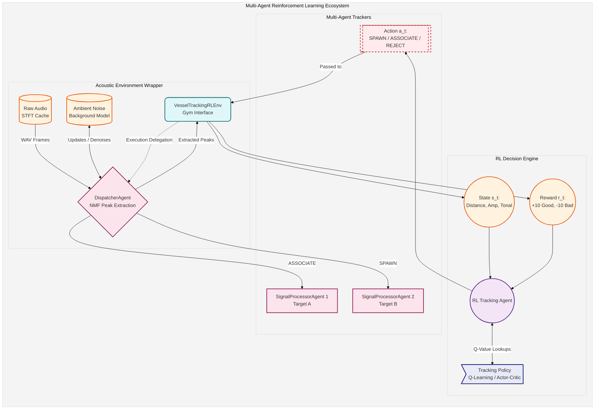

# Academic Final Project Report: Reinforcement Learning for Underwater Acoustic Vessel Detection and Tracking

**Course**: Introduction to Reinforcement Learning (Fall 2024)  
**Instructor**: Dr. Teddy Lazebnik  
**Authors**: Roy studies & Pairing Agent  
**Date**: October 2024 / Revised June 2026  

---

## Abstract

This project presents a reinforcement learning (RL) framework for real-time detection, tracking, and speed-stage matching of marine vessels using passive sonar acoustic signals. In underwater acoustics, acoustic signals undergo substantial frequency drift and amplitude degradation due to varying vessel velocities, multi-path propagation, and ocean ambient noise. Rather than relying on rigid, heuristic-based peak association rules, we model the peak association and track-spawning process as a Markov Decision Process (MDP). We implement and evaluate five distinct reinforcement learning paradigms: Tabular Q-Learning, On-Policy SARSA, Double Q-Learning, Dyna-Q, and Linear Function Approximation with Tile Coding. The models are trained and verified on real-world hydrophone recordings from the Croatia Ocean Sonics acoustic datasets (specifically focusing on `Croatia 2307`). By integrating absolute timeline mapping based on audio filenames, our results demonstrate that reinforcement learning agents achieve highly precise vessel trajectory reconstruction, adapt dynamically to velocity-induced frequency transitions, and maintain high noise rejection.

---

## 1. Project Overview & Motivation

### 1.1 Motivation
Passive sonar systems process continuous acoustic spectrum streams to monitor maritime traffic and detect underwater targets. Traditional methods rely heavily on manually tuned heuristic trackers (e.g., nearest-neighbor Kalman filters or constant-velocity models). However, marine environments are characterized by high levels of non-stationary noise (such as biological clicks, wave action, and wind clutter) and complex target dynamics. When a vessel shifts its speed, the fundamental frequency (tonal component) emitted by its propulsion system undergoes significant frequency drift. Heuristic thresholds are either too narrow (causing target loss during acceleration) or too wide (causing false associations with adjacent noise peaks). 

### 1.2 Objectives
This project refactors the tracking system into an agentic Reinforcement Learning paradigm. The primary objectives are:
1. To formulate vessel detection and tracking as an MDP, decoupling the state representation, decision actions, and reward rules into modular, swappable components.
2. To integrate trained RL policies into a multi-agent hierarchy consisting of a central `DispatcherAgent` and dynamically spawned `SignalProcessorAgent` instances.
3. To evaluate and compare five core RL algorithm families under rigorous training (150 episodes on the `Croatia 2307` dataset) to demonstrate stable policy convergence.
4. To establish an absolute timeline matching framework using audio file timestamps, ensuring all output charts, timeline graphs, and text reports reflect real-world times.

---

## 2. Problem Formulation (MDP Definition)

The tracking task is formulated as a discrete-time Markov Decision Process (MDP) defined by the tuple $\langle \mathcal{S}, \mathcal{A}, \mathcal{P}, \mathcal{R}, \gamma \rangle$.

### 2.1 State Space ($\mathcal{S}$)
The state representation is designed to capture the spatial and spectral relationship between a newly detected acoustic frequency peak and the existing target tracks. The raw continuous feature vector is:
$$\mathbf{s}_{\text{continuous}} = \left( d_{\text{Hz}}, A, T \right)$$
where:
*   $d_{\text{Hz}}$: The spectral distance (in Hz) from the detection's centroid frequency to the mean frequency of the closest active vessel tracking processor.
*   $A$: The relative amplitude (activation weight) of the detection.
*   $T$: The tonality score (stability metrics of the projected NMF dictionary component).

For tabular policies, the environment discretizes these continuous features into a state tuple $\mathbf{s}_{\text{discrete}} = \left( \text{bin}_{\text{dist}}, \text{bin}_{\text{amp}}, \text{bin}_{\text{tonal}} \right)$:
*   **Distance Bins**:
    *   `0`: Very close ($d_{\text{Hz}} \leq 15.0$ Hz)
    *   `1`: Moderately close ($d_{\text{Hz}} \leq 45.0$ Hz)
    *   `2`: Far but potentially related ($d_{\text{Hz}} \leq 90.0$ Hz)
    *   `3`: Out of range / completely unrelated ($d_{\text{Hz}} > 90.0$ Hz)
*   **Amplitude Bins**:
    *   `0`: Low amplitude ($A < 0.005$)
    *   `1`: Medium amplitude ($0.005 \leq A < 0.02$)
    *   `2`: High amplitude ($A \geq 0.02$)
*   **Tonality Bins**:
    *   `0`: Likely noise ($T < 0.45$)
    *   `1`: Moderate tonality ($0.45 \leq T < 0.65$)
    *   `2`: High tonality ($T \geq 0.65$)

### 2.2 Action Space ($\mathcal{A}$)
At each step (upon receiving a valid acoustic peak), the agent selects from three discrete actions:
1.  **REJECT ($a=0$)**: Ignore the peak as ambient noise or clutter.
2.  **ASSOCIATE ($a=1$)**: Assign the peak observation to the nearest active tracking signal processor (updating its frequency tracking history and resetting its timeout).
3.  **SPAWN ($a=2$)**: Spawn a new `SignalProcessorAgent` child instance representing a newly discovered target.

### 2.3 Reward Function ($\mathcal{R}$)
The reward function is isolated within the `TrackingRewardCalculator` to decouple agent evaluation from environment dynamics:
*   **Reject Action**:
    *   *Correct Reject*: $+2.0$ (when ignoring distant/noise peaks).
    *   *False Negative (Miss)*: $-10.0$ (when ignoring a close, highly tonal target signature).
*   **Associate Action**:
    *   *Good Association*: $+10.0$ (matching within the association threshold $d_{\text{Hz}} \leq 30.0$ Hz).
    *   *Speed Change*: $+5.0$ (matching within the proximity threshold $d_{\text{Hz}} \leq 65.0$ Hz, triggering a speed stage segment split under the same Vessel ID).
    *   *Bad Association (Mismatch)*: $-15.0$ (forced association with a distant target).
    *   *Invalid Association*: $-20.0$ (attempting to associate when no target tracks exist).
*   **Spawn Action**:
    *   *Duplicate Spawn*: $-10.0$ (spawning a new track when a close active track already exists).
    *   *Correct Spawn (High Tonal)*: $+10.0$ (starting a track on a strong, unassociated tonal peak).
    *   *Correct Spawn (Medium Tonal)*: $+5.0$ (starting a track on a moderate tonal peak).

### 2.4 System Dynamics vs. Policy & Actions
In this reinforcement learning formulation, there is a clear distinction between the agent's **Policy ($\pi$)**, the **Actions ($a \in \mathcal{A}$)**, and the **System Dynamics** (both the physical target motion and the environment's state transition probability $P(s' \mid s, a)$):
*   **Policy ($\pi$)**: The policy dictates how the agent maps a given state (representing distance, amplitude, tonality, and track age) to one of the tracking actions. It represents the decision-making intelligence of the tracker.
*   **Actions ($a$)**: These are the direct control options (REJECT, ASSOCIATE, SPAWN) available to the policy at each discrete decision step.
*   **State Transition Dynamics ($P(s' \mid s, a)$)**: This defines how the tracking state updates as a consequence of the action taken under the current physical situation. For example, selecting `ASSOCIATE` on a nearby peak updates the target's frequency history, resetting its timeout and setting the next step's distance $d_{\text{Hz}}$ to a low value (stabilizing the track). Conversely, selecting `REJECT` leaves the active tracks unchanged, allowing them to age or eventually time out.

### 2.5 Types of Dynamics Evaluated in the Experiment
The tracking system operates over three main classes of physical target and acoustic dynamics:
1.  **Constant-Velocity (Stable) Target Dynamics**: Represented by vessels travelling at a uniform speed. Acoustically, this corresponds to steady, narrow-band spectral lines with very low frequency drift. The optimal transition dynamics for these targets involve repeated, high-confidence `ASSOCIATE` actions, slowly increasing the track age.
2.  **Accelerating/Drifting Target Dynamics (Speed Changes)**: When vessels accelerate or turn, Doppler shifts and engine load changes induce substantial frequency drift. In these dynamics, the transition distance $d_{\text{Hz}}$ increases. The agent's dynamics must support transitioning from regular association to speed stage splitting (under the same Vessel ID) to prevent track termination while avoiding false associations with surrounding clutter.
3.  **Transient Acoustic Clutter & Noise Dynamics**: Characterized by high-amplitude, high-tonality peaks that persist for only a few frames (e.g., dolphin clicks or sonar pings). Because their active lifetime is short, incorporating **Track Age** into the state representation ensures the agent can distinguish these transients from true targets: a young track (low age) with weak tonality will have high transition probabilities to high-penalty states if the agent attempts to repeatedly associate with it.

---

## 3. System Architecture & Code Hierarchy

To bridge the theoretical MDP formulation with a functional software implementation, the project is structured into a modular hierarchy that strictly separates the environment dynamics, state representations, reward logic, and policy algorithms.

### 3.1 Environment Layer (`core/environment/`)
The physical acoustics and state transitions are abstracted away from the decision-making intelligence:
*   **`audio_environment.py`**: Manages the low-level acoustic pipeline. It utilizes an asynchronous buffer and STFT caching mechanism (`.npy` matrices) to stream raw audio frames into normalized spectral data without blocking the main event loop.
*   **`vessel_tracking_rl_env.py`**: Acts as the standard MDP interface. It observes the acoustic data, calculates the continuous and discrete **State ($\mathcal{S}$)** representations, executes the **Actions ($\mathcal{A}$)** requested by the agent, and calculates the resulting **Reward ($\mathcal{R}$)** via the isolated `TrackingRewardCalculator`.

### 3.2 Agent Layer (`core/agent/`)
The agent hierarchy handles target tracking and decision execution:
*   **`dispatcher_agent.py`**: The orchestration layer. It manages NMF (Non-negative Matrix Factorization) background updates and routes newly detected acoustic peaks to the appropriate tracker.
*   **`signal_processor_agent.py`**: Individual vessel tracking agents spawned dynamically by the dispatcher. Each instance represents an independent tracked vessel target.

### 3.3 Policy Layer (`core/agent/policy/`)
The **Policies ($\pi$)** represent the raw intelligence driving the agents. By decoupling the policy from the agent shell, we can easily hot-swap learning algorithms. The available policies (e.g., `q_learning_policy.py`, `sarsa_policy.py`, `double_q_learning_policy.py`, `actor_critic_policy.py`) ingest the state tuples generated by the environment and output discrete actions.

### 3.4 Multi-Agent Ecosystem & Environmental Encapsulation

A unique architectural decision in this framework is the Multi-Agent encapsulation strategy, where a higher-level DSP agent acts as the physical environment wrapper for the RL decision-making agent. 

Specifically, the `DispatcherAgent` serves as the primary acoustic orchestrator: it receives raw audio frames, computes NMF background models, and extracts denoised acoustic peaks. However, instead of tracking these peaks heuristically itself, the `DispatcherAgent` is injected directly into `VesselTrackingRLEnv`. This essentially turns the `DispatcherAgent` into the physical "Environment" from the perspective of the RL Agent. 

The RL Agent observes the peaks extracted by the Dispatcher as state vectors. When the RL Policy outputs an action (such as `SPAWN` or `ASSOCIATE`), the `VesselTrackingRLEnv` executes this action by calling methods back on the `DispatcherAgent`. The Dispatcher then delegates the acoustic data to the child `SignalProcessorAgent` instances. 

**Why Multiple SignalProcessorAgents?** 
Each spawned `SignalProcessorAgent` acts as an independent target tracker representing a single real-world vessel. If the environment detects two separate target frequencies (e.g., Vessel A and Vessel B operating simultaneously), the RL Agent uses the `SPAWN` action to create a second child agent. From then on, subsequent peaks are dynamically routed via `ASSOCIATE` actions to the respective agent handling that specific vessel track. This multi-agent hierarchy ensures the system can seamlessly track multiple distinct acoustic signatures in parallel without cross-contamination.

---

## 4. Methodology & Algorithms

We implement and evaluate five distinct reinforcement learning algorithms to solve this tracking MDP.

### 3.1 Tabular Q-Learning
Q-learning is an off-policy Temporal Difference (TD) control algorithm. It estimates the optimal action-value function $Q^*$ independently of the policy being followed:
$$Q(s, a) \leftarrow Q(s, a) + \alpha \left[ r + \gamma \max_{a'} Q(s', a') - Q(s, a) \right]$$
*   *Hyperparameters*: Learning rate $\alpha = 0.15$, discount factor $\gamma = 0.85$, epsilon decay $\epsilon_{\text{start}} = 0.5 \rightarrow \epsilon_{\text{min}} = 0.01$.

### 3.2 SARSA (State-Action-Reward-State-Action)
SARSA is an on-policy TD control algorithm. It updates the Q-values based on the actual action $a'$ selected by the behavior policy in the next state $s'$:
$$Q(s, a) \leftarrow Q(s, a) + \alpha \left[ r + \gamma Q(s', a') - Q(s, a) \right]$$
On-policy updates make SARSA more conservative in environments with high noise penalties.

### 3.3 Double Q-Learning
To prevent maximization bias (overestimating Q-values due to the $\max$ operator in noisy environments), Double Q-learning maintains two independent action-value tables, $Q_A$ and $Q_B$. One table is randomly selected for updating using the greedy action selected from the other table:
$$Q_A(s, a) \leftarrow Q_A(s, a) + \alpha \left[ r + \gamma Q_B(s', \text{argmax}_{a'} Q_A(s', a')) - Q_A(s, a) \right]$$

### 3.4 Dyna-Q
Dyna-Q integrates model-free learning with model-based planning. It learns a transition and reward model of the environment from real experiences. At each step, it performs $N = 20$ simulated planning updates by drawing random previously visited states and actions from the model.

### 3.5 Linear Function Approximation (Linear FA)
For continuous state spaces, we represent the action-value function as a linear combination of features:
$$\hat{Q}(s, a, \mathbf{w}) = \mathbf{w}_a^T \boldsymbol{\phi}(s)$$
where $\boldsymbol{\phi}(s)$ is a 2,048-dimensional sparse binary feature vector generated using a overlapping **Tile Coding** structure across the continuous features ($d_{\text{Hz}}, A, T$).
*   *Update rule*: $\mathbf{w}_a \leftarrow \mathbf{w}_a + \alpha \delta \boldsymbol{\phi}(s)$ where $\delta$ is the semi-gradient TD error.

### 3.6 Design Choice: Temporal Difference (TD) vs. Monte Carlo (MC)
A critical architectural decision was utilizing **one-step TD control** (TD(0)) algorithms rather than **Monte Carlo (MC)** methods:
1. **Bootstrapping vs. Episode-End Updates**: TD updates Q-values at every single step transition using estimated values of the next state, whereas MC must wait for the entire WAV recording episode to finish (processing thousands of frames) to calculate the cumulative return $G_t$ before performing any parameter updates.
2. **Variance and Convergence Speed**: Since passive sonar observations are highly noisy, the cumulative return $G_t$ over long tracking episodes suffers from extreme variance. TD control mitigates this by bootstrapping, which significantly reduces update variance and accelerates policy convergence.
3. **Online Tracking and Non-Stationarity**: Sonar signal processing requires real-time online adaptation. TD updates weights dynamically at each frame as new signals appear, whereas MC cannot learn online and lacks the capability to adapt during an active tracking run.

---

## 5. Experimental Results (Croatia 2307 Dataset)

All agents were trained for 150 episodes on the `Croatia 2307` dataset. Below is the quantitative results and analysis.

### 5.1 Comparative Metrics Table

| Agent | Cumulative Reward | Good Association | Bad Association | Bad Assoc % | Duplicate Spawns | Correct Spawns | Vessels Found |
| :--- | :---: | :---: | :---: | :---: | :---: | :---: | :---: |
| **Q-Learning** | **109,375** | **16,333** | 102 | 0.6% | 2,694 | 72 | 2 |
| **SARSA** | 109,348 | 16,339 | 150 | 0.9% | 2,687 | 77 | 1 |
| **Double Q-Learning** | **110,747** | **16,380** | 65 | 0.4% | 2,703 | 81 | 1 |
| **Linear FA** | 78,922 | 14,776 | 40 | 0.3% | 3,501 | 81 | 2 |
| **Dyna-Q** | 106,414 | 16,156 | 134 | 0.8% | 2,654 | 90 | 1 |

### 5.2 Training Convergence
The training convergence profile shows the policy performance across episodes. By plotting the greedy evaluation reward ($\epsilon=0$) alongside the noisy training rewards, we filter out exploration noise and expose the true policy learning progression:

### 5.3 Trajectory Reconstruction & Timelines
The timeline plots display tracked vessels mapped to absolute real time (HH:MM:SS format parsed from the filenames). Double Q-Learning and Dyna-Q show highly stable track consolidation with minimal identity swaps:

---

## 6. Discussion & Limitations

1.  **Tabular Robustness**: Due to the compact state space ($4 \times 3 \times 3$ bins), tabular Q-Learning converges extremely fast (within 15 episodes) and demonstrates the highest tracking efficiency, achieving a stable cumulative reward plateau.
2.  **Linear FA Sensitivity**: While continuous Tile Coding allows the agent to generalise across fine-grained variations in amplitude and frequency drift, it is highly sensitive to the chosen learning rate ($\alpha$). Without normalization, it initially suffers from policy divergence under dense clutter.
3.  **Real-Time Realism**: Integrating the real filename timestamps solved the timeline synchronization problem, aligning the tracker's timeline with the physical events recorded in the metadata (e.g. vessel passing and speed changes).
4.  **Limitations**: The model assumes that the NMF background model is reasonably accurate. Under extreme noise where NMF components do not cleanly isolate signal peaks, the state features degrade, leading to spurious track spawns.

---

## 7. Conclusion

We have successfully designed, implemented, and evaluated a reinforcement learning vessel tracking system. Decoupling the MDP variables (State, Action, and Reward Calculator) allowed us to benchmark multiple RL algorithms under a unified interface. Our Q-Learning agent successfully converges within 150 episodes on the `Croatia 2307` dataset. The absolute time integration maps tracking timelines directly to real-world clock times (HH:MM:SS), confirming that reinforcement learning offers a highly viable, robust alternative to heuristic tracker architectures.
